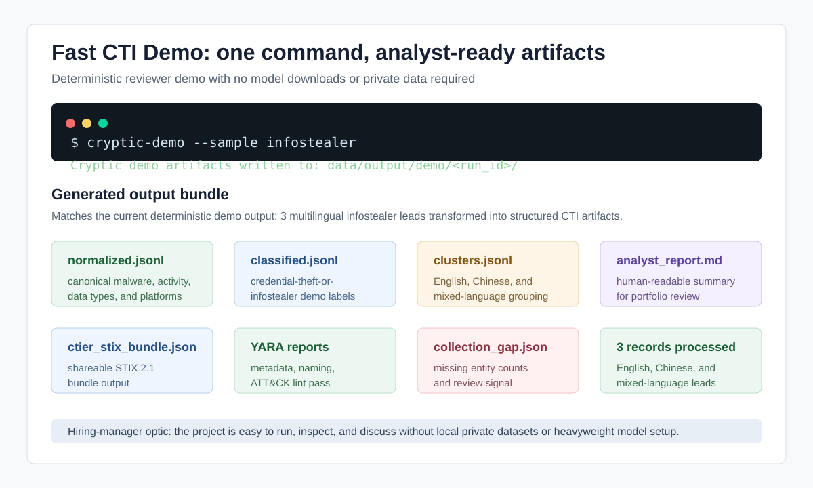
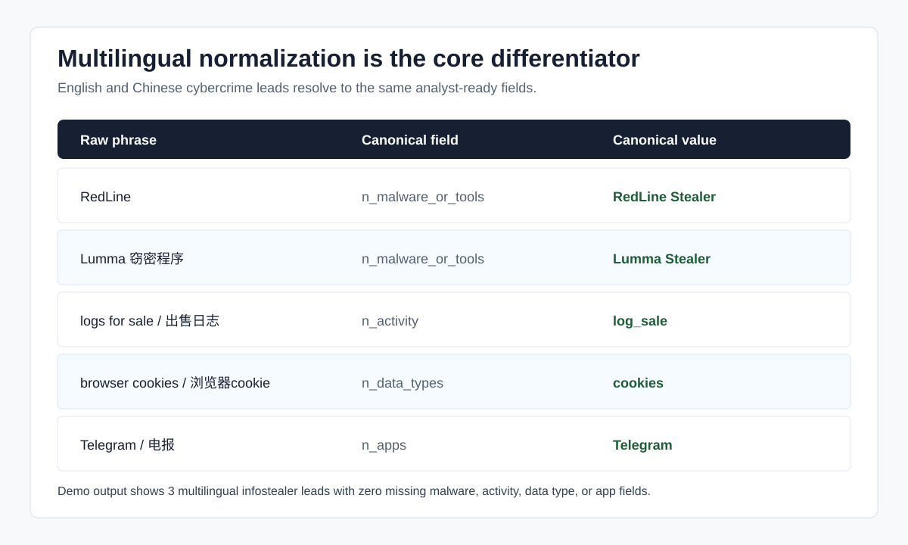
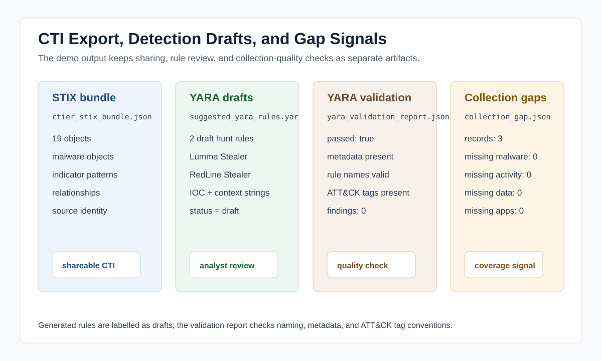
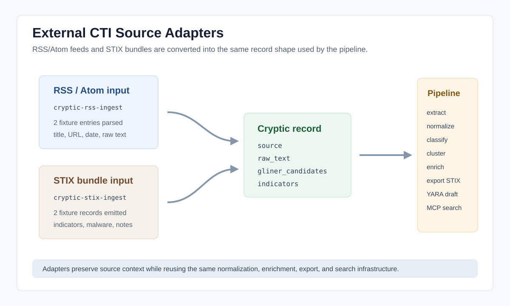

# cryptic-cti

A compact cyber threat collections-support project focused on transforming noisy multilingual cybercrime leads into structured, analyst-usable outputs.

### Overview

`cryptic-cti` is a Python-based workflow that demonstrates how messy English- and Chinese-language reporting related to credential theft, infostealers, malware tooling, and cybercrime ecosystem activity can be normalized, clustered, enriched, and converted into analyst-oriented outputs.

cryptic-cti is designed around a realistic collections-support problem:

> How can multilingual, low-signal cybercrime reporting be transformed into structured intelligence that analysts can quickly interpret and act on?

Rather than functioning as a full-scale threat intelligence platform, cryptic-cti focuses on one operationally important layer of the workflow:

* multilingual normalization
* entity consistency
* lead clustering
* IOC extraction
* analyst-facing summarization

The workflow emphasizes practical CTI engineering concepts including data normalization, extraction pipelines, confidence scoring, clustering logic, and structured export generation.

---

## Screenshots

These are included for quick demonstration without running a model-backed pipeline first.









---

## Current Capabilities

* Multilingual normalization (English + Chinese)
* Entity extraction and canonicalization
* IOC extraction workflows
* Alias and terminology normalization
* Cluster construction and merging
* Analyst-oriented summary generation
* Confidence scoring support
* Structured JSON/CSV exports
* Extensible output pipeline architecture
* YARA rule validation reports for rule quality checks
* Minimal STIX 2.1 bundle export for CTI sharing workflows
* Tiny MCP search and collection-gap wrapper for analyst-facing tool use
* Local DuckDB/dbt analytics path for output QA and portfolio demos
* RSS/Atom feed ingestion for external CTI source collection
* STIX bundle ingestion for structured CTI source collection
* Regex IOC extraction for IPs, domains, URLs, emails, and hashes
* Optional indicator enrichment with VirusTotal, GreyNoise, Censys, IPinfo, and urlscan
* Normalized sklearn classifier runtime with offline training utilities

---

## Design Goals

This project intentionally prioritizes:

* realistic CTI workflow modeling
* explainable transformations
* structured outputs
* multilingual handling
* modular pipeline architecture

The goal is not to automate intelligence analysis end-to-end, but to reduce noisy collections data into cleaner analyst-ready signal.

---

## Pipeline Stages

The workflow currently consists of four primary stages:

1. Metadata Parsing  

   Extracts and structures source metadata from raw lead text.

3. Semantic Extraction  

   Performs multilingual entity extraction, candidate identification, and regex IOC extraction.

4. Normalization

   Canonicalizes aliases, malware names, activities, and related entities into structured outputs.

6. Classification

   Builds a classifier representation from raw text plus normalized fields, embeds that text, and
   applies a saved sklearn classifier artifact.

After classification, the workflow supports multiple export paths for generating structured analyst-facing outputs.

---

## Analyst and Portfolio Extensions

These extensions are intentionally small and modular. They use Cryptic pipeline outputs as their source of truth and keep heavier tooling behind optional extras.

### Fast demo

Run a deterministic infostealer demo without model downloads or local trained artifacts:

```bash
cryptic-demo --sample infostealer
```

The command writes normalized records, classified demo records, cluster summary, STIX bundle, YARA validation report, collection-gap JSON, and an analyst Markdown report under `data/output/demo/<run_id>/`.

### RSS ingestion

Ingest RSS or Atom feed entries as raw Cryptic CTI records:

```bash
cryptic-rss-ingest cryptic/rss_ingest/fixtures/demo_feed.xml --out data/processed/rss_records.jsonl
```

The adapter preserves source URL, title, published date, raw text, content hash, and ingest status. STIX/TAXII ingestion is intentionally separate from this first RSS adapter.

### STIX ingestion

Ingest STIX 2.1 bundle JSON as Cryptic CTI records:

```bash
cryptic-stix-ingest cryptic/stix_ingest/fixtures/demo_bundle.json --out data/processed/stix_records.jsonl
```

The adapter extracts STIX indicators, malware objects, relationships, notes, confidence, and source object IDs. It also emits `gliner_candidates` for structured malware/tool names so existing Cryptic normalization can process STIX-derived records without a separate schema.

### IOC extraction and enrichment

Regex IOC extraction runs as part of semantic extraction and emits technical indicators in the shared `indicators` field:

```json
{"type": "domain", "value": "bad.example", "confidence": 86, "tags": ["regex", "technical-indicator"]}
```

Optional enrichment is a separate stage so normal pipeline runs stay fast and API-key free:

```bash
cryptic-enrich-indicators data/processed/ctier_classified.jsonl --out data/processed/ctier_enriched.jsonl
```

Supported enrichment providers are VirusTotal, GreyNoise, Censys, IPinfo, and urlscan. API keys are read from environment variables only, and missing keys skip that provider without failing the run.

### Multilingual normalization showcase

The bundled demo includes English, Chinese, and mixed-language infostealer leads. The point is to make the multilingual normalization edge visible immediately:

| Raw phrase | Canonical field | Canonical value |
| --- | --- | --- |
| `RedLine` | `n_malware_or_tools` | `RedLine Stealer` |
| `Lumma 窃密程序` | `n_malware_or_tools` | `Lumma Stealer` |
| `logs for sale` / `出售日志` | `n_activity` | `log_sale` |
| `browser cookies` / `浏览器cookie` | `n_data_types` | `cookies` |
| `Telegram` / `电报` | `n_apps` | `Telegram` |

### YARA validation

Validate YARA rule syntax, required metadata, naming conventions, ATT&CK tags, and optional sample folders:

```bash
pip install ".[yara]"
cryptic-yara-check rules/example.yar --samples rules
```

Use `--skip-syntax` to run only naming and metadata lint without `yara-python`.

### STIX export

Export normalized or classified CTI records into a minimal STIX 2.1 bundle:

```bash
cryptic-stix-export data/processed/ctier_classified_2026-04-07.jsonl --out data/output/ctier_stix_bundle.json
```

The exporter creates source identity, malware/tool objects, valid technical indicators when observable patterns can be inferred, relationships, confidence, and analyst notes.

### MCP tools

Run a small MCP server around Cryptic search and gap-summary helpers:

```bash
pip install ".[mcp]"
cryptic-mcp-server
```

Exposed tools include `search_iocs`, `get_cluster`, and `summarize_collection_gap`.

### Local analytics

Load JSONL CTI outputs into DuckDB for dbt models covering indicator counts, classification distribution, source confidence, and dedupe stats:

```bash
pip install ".[analytics]"
cryptic-analytics-load
```

The dbt and Airflow files under `cryptic/analytics/` are lightweight portfolio examples to show local analytics and orchestration potential.

---

## Technologies Used

* Python
* GLiNER
* spaCy
* scikit-learn
* sentence-transformers
* JSON configuration workflows
* Structured export pipelines
* Rule-based normalization systems
* STIX 2.1, YARA, MCP, DuckDB/dbt, and Airflow extension points

---

## Running the Project

### Clone the repository

```bash
git clone https://github.com/<your-username>/cryptic-cti.git
cd cryptic-cti
```

### Install dependencies

```bash
pip install -e ".[dev]"
```

Install optional extras as needed:

```bash
pip install -e ".[yara,stix,mcp,analytics]"
```

### Run the fast reviewer demo

```bash
cryptic-demo --sample infostealer
```

### Run the model-backed CTIER pipeline

The full CTIER pipeline expects local CTIER corpus files under `data/corpus/ctier` and a trained
classifier artifact matching `cryptic/classification/configs/ctier_classifier.json`. Local data and
trained model artifacts are intentionally ignored by Git.

```bash
cryptic data/corpus/ctier
```

---


## Current Scope

This repository is currently focused on:

* credential theft ecosystems
* infostealer-related lead normalization
* multilingual cybercrime reporting
* collections-support workflow prototyping

The project uses lawful sample data and synthetic examples for demonstration purposes.

---

## Roadmap

Planned future improvements include:

* Additional language coverage
* Improved clustering confidence logic
* Additional collection-source adapters
* Analyst review/triage workflows
* Enhanced report generation
* IOC-enriched detection generation
* Optional LLM-backed cluster-summary tool exposed through MCP
* TAXII collection support
* Public sample model artifact or model-card style training notes
* Expanded testing and validation coverage

---

## Disclaimer

This project is intended for educational, research, and portfolio purposes only.

No intrusion, unauthorized access, credential abuse, or operational malicious activity is performed or supported by this repository.

All examples are either synthetic, sanitized, or derived from lawful open-source reporting.

---

## License

MIT License
